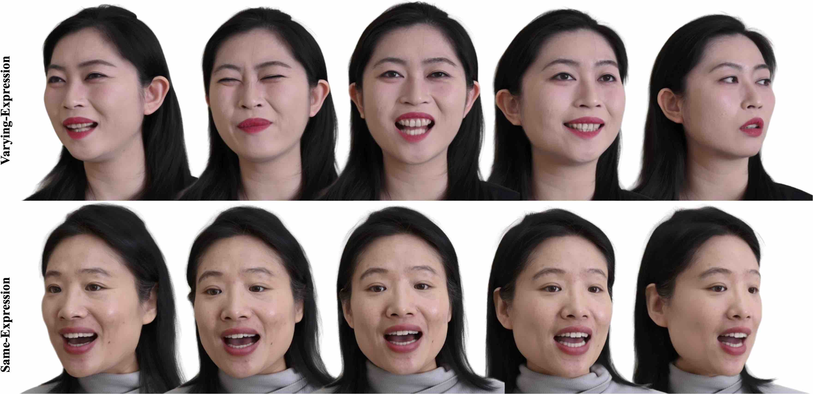

# Tri2Plane
The repository for **Tri<sup>2</sup>-plane: Volumetric Avatar Reconstruction with Feature Pyramid**
> [**Tri<sup>2</sup>-plane: Thinking Head Avatar via Feature Pyramid**],    
> *Arxiv Link: [https://arxiv.org/abs/2401.09386](https://arxiv.org/abs/2401.09386)*,   
> *Luchuan Song, Pinxin Liu, Lele Chen, Guojun Yin and Chenliang Xu*,     
> *Project Page: [https://songluchuan.github.io/Tri2Plane.github.io/](https://songluchuan.github.io/Tri2Plane.github.io/)*,     
> *Arxiv 2024* 


<div align="center">
<!--   <a href="https://github.com/Songluchuan/Tri2plane" target="_blank"> -->
    
  </a>
</div>

<h2 align="center">Abstract</h2>
Recent years have witnessed considerable achievements in facial avatar reconstruction with neural volume rendering. Despite notable advancements, the reconstruction of complex and dynamic head movements from monocular videos still suffers from capturing and restoring fine-grained details. In this work, we propose a novel approach, named Tri<sup>2</sup>-plane, for monocular photo-realistic volumetric head avatar reconstructions. Distinct from the existing works that rely on a single tri-plane deformation field for dynamic facial modeling, the proposed Tri<sup>2</sup>-plane leverages the principle of feature pyramids and three top-to-down lateral connections tri-planes for details improvement. It samples and renders facial details at multiple scales, transitioning from the entire face to specific local regions and then to even more refined sub-regions. Moreover, we incorporate a camera-based geometry-aware sliding window method as an augmentation in training, which improves the robustness beyond the canonical space, with a particular improvement in cross-identity generation capabilities. Experimental outcomes indicate that the Tri<sup>2</sup>-plane not only surpasses existing methodologies but also achieves superior performance across both quantitative metrics and qualitative assessments through experiments. 


<h2 align="center">Code (Coming Soon)</h2>


<h2 align="center">Video</h2>
<div align="center">
  <a href="https://www.youtube.com/watch?v=qU7zijI2DCQ" target="_blank">
    
  </a>
</div>


<h2 align="center">Citation</h2>

```commandline
@article{song2024tri,
  title={Tri $\^{}$\{$2$\}$ $-plane: Volumetric Avatar Reconstruction with Feature Pyramid},
  author={Song, Luchuan and Liu, Pinxin and Chen, Lele and Yin, Guojun and Xu, Chenliang},
  journal={arXiv preprint arXiv:2401.09386},
  year={2024}
}
```

